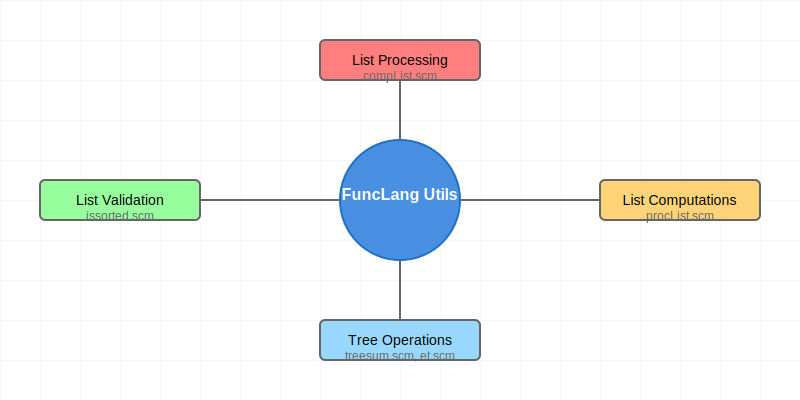

# FuncLang Utility Functions Collection



A comprehensive collection of utility functions implemented in FuncLang (a Scheme-like language), demonstrating functional programming patterns and common algorithms. This collection includes list processing, tree operations, validation functions, and computational utilities.

## Components

### List Processing (`compList.scm`)
- `removeConsecutive`: Removes consecutive duplicate elements from a list
- `compList`: Main interface for list compression functionality

### Tree Operations
#### Expression Trees (`et.scm`)
- `leaf`: Constructor for leaf nodes
- `root`: Constructor for internal nodes
- `treesum`: Computes sum of all values in a tree

#### Tree Processing (`treesum.scm`)
- Advanced tree operations with leaf/node distinction
- Includes value retrieval and traversal functions

### List Validation (`issorted.scm`)
- `isSortedAscending`: Checks if a list is in ascending order
- `isSortedDescending`: Checks if a list is in descending order
- `isSorted`: Determines if a list is sorted in either direction

### List Computations (`procList.scm`)
- `procList`: Processes two lists with a given operation
- `add`: Adds corresponding elements of two lists
- `common`: Finds common elements between lists

## Usage Examples

### List Compression
```scheme
(define lst '(1 1 2 2 2 3 4 4 5))
(compList lst)
;; Output: (1 2 3 4 5)
```

### Sorting Validation
```scheme
(define lst1 '(1 2 3 4 5))
(define lst2 '(5 4 3 2 1))
(isSorted lst1) ;; #t
(isSorted lst2) ;; #t
```

### Tree Operations
```scheme
(define tree1 
  (root 
    (leaf 5)
    (leaf 3)))
(treesum tree1) ;; 8
```

### List Processing
```scheme
(define pairs1 (list (cons 1 3) (cons 4 2)))
(define pairs2 (list (cons 2 6) (cons 4 2)))
(procList add pairs1 pairs2)
;; Output: ((3 . 9) (8 . 4))
```

## Implementation Details

All functions follow functional programming principles:
- Pure functions with no side effects
- Immutable data structures
- Recursive implementations
- Pattern matching through conditional expressions

## Time Complexity

- List Compression: O(n)
- Tree Operations: O(n)
- List Validation: O(n)
- List Processing: O(n)

where n is the size of the input (number of elements or nodes)

